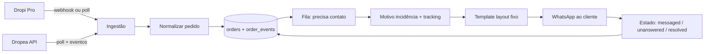

# ELEVATE — Arquitetura (foco na dor)

## Dor (única)

Operadores perdem entregas porque **não conseguem, em escala e em segundos**, ver a incidência de frete (Dropi Pro / Dropea), montar a mensagem certa com **layout fixo + link de rastreio** e contactar o cliente no WhatsApp.

Produto = **máquina de recuperação de entrega**, não dashboard financeiro genérico.

---

## Filtro do que existe hoje

### Manter e endurecer (núcleo)

| Peça atual | Por quê |
| --- | --- |
| Board de pedidos + filtros por status | Fila de trabalho do operador |
| Card / dialog com mensagem sugerida + WhatsApp | Ação principal |
| Templates por motivo (`suggestedMessage`) | Layout de mensagem |
| Webhook `POST /api/public/webhooks/orders` | Ingestão de eventos |
| Tabelas Supabase `orders` + `order_events` | Fonte da verdade |
| Página Integração API (virar Settings de sync) | Configurar Dropi/Dropea |
| AppShell + tema | Casca mínima |

### Manter com regras claras (operação + lucros)

| Peça | Regra |
| --- | --- |
| Inbox / Orders | **Abas separadas por supply**: Dropi \| Dropea — nunca misturar na fila operacional |
| Dados do webhook Dropi | **Informar ao cliente final** na mensagem (status, details/motivo, tracking_code, tracking_url, transportadora) |
| Lucros / financeiro | Vista **à parte**: pode filtrar por supply, data, etc. e ver Dropi + Dropea juntos |
| Conversor de moeda | Global, rápido, **taxas em tempo real** (não hardcode 6.32) — EUR/BRL prioritários, seletor com todas as moedas |

### Cortar do MVP (ruído)

| Peça atual | Motivo |
| --- | --- |
| Pricing / planos / upgrade CTA | SaaS prematuro |
| Analytics com KPIs inventados | Sem dados reais ainda |
| Integração Ads Meta / ROAS / campanhas | Outro produto |
| “Queue send” / “Automation syncing 98%” fake | Promete o que não existe |
| Busca global no header sem função | Ruído |
| User fake “Rocío M.” / uso de mensagens do plano | Cosmético |
| Help Center genérico (reduzir a 1 FAQ de sync+WA) | Depois |

### Depois do núcleo (fase 2+)

- Depois do núcleo: WhatsApp Web gateway (Baileys), auth multi-loja, billing, analytics reais

---

## Fluxo alvo (core loop)



1. **Entrada:** pedido muda de status na supply (esp. incidência / novidade).
2. **Normalização:** um modelo único ELEVATE (fonte Dropi | Dropea).
3. **Fila:** só o que precisa ação humana (ou automação).
4. **Contexto:** motivo + código + URL rastreio + telefone.
5. **Mensagem:** layout fixo + variáveis; 1 clique (ou envio API).
6. **Estado:** operador marca / sistema marca messaged → unanswered → resolved.

---

## Modelo de domínio (o que importa)

### `orders` (snapshot atual)

Campos mínimos:

- `order_id`, `source` (`dropi_pro` | `dropea`)
- `customer_name`, `phone` (E.164)
- `status` interno: `confirmed` | `in_transit` | `incident` | `messaged` | `unanswered` | `delivered` | `cancelled`
- `incident_reason` (normalizado, ver abaixo)
- `tracking_code`, `tracking_url`, `shipping_company`
- `product_summary`, `postal_code`, `city`, `total`
- `last_event_at`, `last_contacted_at`, `message_status`

### `order_events` (histórico)

Já existe — manter como audit log de cada mudança da supply.

### `message_templates`

- `key` (ex.: `incident.wrong_address`)
- `body` com placeholders: `{{first_name}}`, `{{order_id}}`, `{{product}}`, `{{postal}}`, `{{city}}`, `{{tracking_code}}`, `{{tracking_url}}`, `{{reason}}`
- **Layout obrigatório** (3 blocos): saudação → corpo do motivo → CTA + rodapé  
  Igual ao espírito atual de `suggestedMessage` em `src/lib/orders.ts`.

### Motivos normalizados (catálogo)

Mapear textos sujos da transportadora/supply para chaves estáveis:

| Chave | Exemplos |
| --- | --- |
| `refused` | Pacote recusado |
| `wrong_address` | Endereço incorreto / incompleto |
| `reschedule` | Cliente pediu reagendamento |
| `absent` | Ausente / não localizado |
| `customs` | Alfândega / documentação |
| `damaged` | Avaria |
| `unknown` | Fallback |

O “buscador de frete” no MVP = **painel do pedido** que mostra: status supply + motivo normalizado + último evento + link rastreio externo. Não é um produto de cotação de frete.

---

## Integrações

### Dropea (API pública existe)

- Base: `https://api.dropea.com/api/v1/order` (token `X-API-KEY`)
- Já traz: buyer/phone, shipments com `tracking` + `tracking_url`, status
- Estratégia: **poll periódico** (ex. 1–2 min) + upsert; webhook se/quando disponível na conta

### Dropi Pro

- Hoje o app já aceita payload genérico no webhook (order_id, status, tracking_*)
- Estratégia: **webhook como caminho principal** (URL ELEVATE cadastrada na plataforma / Zapier / n8n se necessário) + poll se houver API estável na conta do cliente
- Normalizer `dropi_pro` → mesmo schema

### WhatsApp

| Fase | Provider | Como |
| --- | --- | --- |
| MVP | `wa.me` | Template renderizado + 1 clique por pedido |
| Fase 1 (atual) | `whatsapp_web` (infra) | Gateway Node + schema sessions/keys; UI QR stub; Meta isolado em `meta_cloud` |
| Fase 2+ | `whatsapp_web` | Baileys no gateway: QR real, scan, send/receive, reconnect |
| Legado | `meta_cloud` | Meta Embedded Signup + Cloud API — **UI desactivada**, dados preservados |

**Arquitectura provider (Fase 1):**

```
src/lib/whatsapp/
  domain-types.ts
  providers/
    registry.ts          ← WHATSAPP_PROVIDER (default whatsapp_web)
    whatsapp-web/        ← facade activa (stub Fase 1)
    meta-cloud/          ← legado isolado (Embedded Signup, Graph, tokens)
services/whatsapp-gateway/
  GET /health → 200      ← scaffold; Baileys na Fase 2
```

- Credenciais Baileys: `whatsapp_sessions` + `whatsapp_session_keys` (RLS service_role only)
- Tokens Meta legado: `whatsapp_connection_secrets` (RESTRICT on delete — non-blocker documentado)
- QR **nunca** persistido — SSE ephemeral (Fase 2)
- Status `whatsapp_connections` via Supabase Realtime
- Gateway single instance (`replicas = 1`); `WHATSAPP_SESSION_ENCRYPTION_KEY` só no gateway

Layout da mensagem **não muda** entre fases — só o transport (`wa.me` → gateway).

---

## Arquitetura de app (camadas)

```
src/
  domain/           # tipos Order, IncidentReason, Template (puro)
  integrations/
    dropea/         # client + mapper
    dropi/          # webhook parse + mapper
  lib/whatsapp/
    providers/
      whatsapp-web/ # active QR gateway facade
      meta-cloud/   # legacy Meta Cloud API (UI inactive)
  sync/             # jobs: poll, normalize, upsert
  features/
    inbox/          # fila de trabalho (substitui mock board)
    order-detail/   # motivo + rastreio + mensagem
    templates/      # editar layouts
    connections/    # tokens Dropi/Dropea (ex-settings enxuto)
  routes/           # só rotas do núcleo
```

### Rotas MVP (substituir o menu atual)

| Rota | Função |
| --- | --- |
| `/` ou `/inbox` | **Inbox** — abas Dropi \| Dropea |
| `/orders` | **Orders** — tabela sync, mesmas abas |
| `/orders/$id` | Drawer/detalhe: frete, motivo, mensagem, WA |
| `/templates` | **Templates** — layouts por motivo |
| `/profits` | **Profits** — filtros supply + data (pode agregar) |
| `/connections` | **Connections** — webhook Dropi + API Dropea |

Tudo o resto sai do menu até o núcleo estar vivo.

### Separação de plataformas (regra de UX)

```
Operação (Inbox / Orders)     →  [ Dropi ]  [ Dropea ]   ← nunca misturar cards
Lucros / relatórios           →  filtros: supply = todas | dropi | dropea + período
Mensagem ao cliente           →  só dados DAQUELE pedido (da supply dele)
```

### Dados Dropi → cliente (obrigatório no template)

Do webhook, o que deve poder ir na mensagem (quando existir):

- `status_name` / `details` (motivo da incidência)
- `tracking_code` + `tracking_url`
- `shipping_company`
- `order_id` (e `shopify_order_id` se útil)
- `total` (opcional no texto; sempre formatável na UI)

Nunca inventar tracking_url. Nunca misturar pedido Dropi com copy/contexto Dropea.

### Moedas (conversor global)

- Valor canônico no banco: guardar `total` + `currency` da supply quando soubermos (default EUR se Dropi/ES-PT, etc.)
- UI: seletor rápido de moeda (EUR, BRL em destaque; lista completa ISO ao lado)
- Taxas: API de câmbio (ex. Frankfurter / open.er-api), cache curto no server (ex. 1h), **zero hardcode** tipo `EUR_TO_BRL = 6.32`
- Preferência do operador em `localStorage` / perfil
- Usar o mesmo conversor em Inbox (totais), detalhe do pedido e Lucros

---

## Regras de produto (cura a dor)

1. **Um clique = mensagem correta** — operador não redige do zero.
2. **Tracking link sempre no template** quando existir; se não houver, template sem link (nunca inventar URL).
3. **Inbox ordenada por urgência** — incident > unanswered > messaged antigo.
4. **Idempotência** — reprocessar webhook/poll não duplica evento nem spam de mensagem.
5. **Estado de contacto** separado do status da transportadora (pode estar `incident` + `messaged`).
6. **Mock some** — board lê só Supabase sync; demo seed opcional em dev.

---

## Critérios de sucesso (MVP)

- Pedido novo/atualizado da Dropea ou Dropi aparece no Inbox em &lt; 2 min
- Incidência mostra motivo legível + link rastreio
- Template certo pré-preenchido; layout estável
- Operador processa dezenas de clientes em sequência sem sair do fluxo
- Histórico de eventos por pedido consultável

---

## Ordem de implementação sugerida

1. Normalizers Dropi/Dropea + enriquecer schema (`phone`, `incident_reason`, `message_status`)
2. Sync real (webhook endurecido + poll Dropea) — service role no env
3. Inbox real ligada ao Supabase (matar mock `lib/orders.ts` na UI)
4. Templates versionados + render com tracking
5. Detalhe do pedido = “buscador de frete” (timeline + motivo)
6. Atalhos de escala (próximo pedido, copiar, bulk open WA)
7. Só então: WA Business API, auth, analytics reais

---

## Arquitetura visual

**Canon:** [DESIGN.md](DESIGN.md) · regra Cursor `.cursor/rules/elevate-identity.mdc`.

Premium operational ecommerce SaaS (Linear / Stripe ops / Vercel / fintech) — workspace de operação, não analytics.

### Stack visual

| Camada | Escolha |
| --- | --- |
| Base | shadcn/ui + Tailwind 4 + tokens DESIGN.md |
| Tabelas | TanStack Table (`/orders`, `/profits`) |
| Motion | controlado (tabs, drawers, status, conversor, skeleton) |
| 21st.dev | inspiração only |

### Nav ONLY

Inbox · Orders · Templates · Profits · Connections  

### Shell

```
┌─────────────────────────────────────────────────────────┐
│ ELEVATE   Inbox · Orders · Templates · Profits · Conn.  │
│           currency ▼                                      │
├───────────────┬─────────────────────────────────────────┤
│ filters       │  [ Dropi ] [ Dropea ]                     │
│               │  dense table (TanStack)                   │
│               ├─────────────────────────────────────────┤
│               │  drawer: freight · reason · msg · WA      │
└───────────────┴─────────────────────────────────────────┘
```

---

## Decisão explícita

**Importante:** sync → incidente/rastreio → mensagem (dados da supply) → WhatsApp → estado; lucros com filtros; conversor multi-moeda; identidade DESIGN.md.  
**Proibido no chrome:** Pricing, Meta Ads, Analytics, Upgrade, busca/notificações fake.  
**Operação:** Dropi e Dropea nunca na mesma fila.
