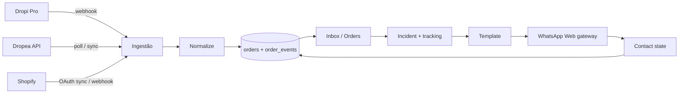

# ELEVATE Orders

> Product and architecture truth. Visual/UX: [DESIGN.md](DESIGN.md).  
> Implementation snapshot: [docs/CURRENT_STATE.md](docs/CURRENT_STATE.md).  
> When docs conflict: **code + CURRENT_STATE** = reality; **this file** = intended architecture; **DESIGN** = visual.

---

## Product Definition

ELEVATE is an **operational ecommerce workspace**.

**Primary problem:** identify orders that need intervention, understand incidents/tracking, contact customers, follow resolution.

It is **not** a generic analytics dashboard.

Operators lose deliveries when they cannot, at scale and in seconds: see freight incidents (Dropi Pro / Dropea), build the right message (fixed layout + tracking link), and contact the customer on WhatsApp.

---

## Core Loop

```
Supply / Store
→ ingestion
→ normalization
→ Supabase
→ operational queue
→ incident/tracking context
→ message/template
→ WhatsApp
→ contact state
→ resolution
```



---

## Official Navigation

**ONLY:**

1. Inbox (`/`)
2. Orders (`/orders`)
3. Templates (`/templates`)
4. Profits (`/profits`)
5. Connections (`/connections`)

**Forbidden in chrome:** Pricing, Meta Ads, Analytics, Upgrade CTA, fake global search, fake notification bell.

Also present (not nav): `/login`, `/onboarding`, `/settings` (user menu), legacy redirects (`/pricing`, `/analytics`, `/ads`, `/integracao-api`), `/help` (no nav link).

---

## Architecture

### Stack (as implemented)

| Layer | Choice |
| --- | --- |
| App | TanStack Start + React 19 + TypeScript + Vite |
| UI | Tailwind 4 + shadcn/ui + TanStack Table |
| Auth / DB | Supabase (Auth, Postgres, Realtime, RLS) |
| Hosting (web) | **Vercel** |
| WhatsApp gateway | **Railway** — `services/whatsapp-gateway/` (Baileys, always-on) |

### Layers

| Layer | Path | Role |
| --- | --- | --- |
| UI routes | `src/routes/*` | Pages + public/internal API handlers |
| Domain | `src/lib/order-domain.ts`, `src/lib/orders/*` | Status, supply, COD, tracking safety |
| Sync queries | `src/lib/synced-orders.functions.ts` | List/filter orders from Supabase |
| Integrations | `src/lib/integrations/{dropi,dropea,shopify}` | Webhook/normalize/sync |
| WhatsApp | `src/lib/whatsapp/**` + `services/whatsapp-gateway/` | Provider registry, send, inbound, QR |
| Supabase clients | `src/integrations/supabase/*` | Browser / SSR / service-role |
| Migrations | `supabase/migrations/*.sql` | Schema through COD / credentials |

### Frontend

- File-based routes (`src/routes/`). App shell: sidebar + header (`src/components/app-shell/`).
- Data via TanStack Query + TanStack Start **server functions** (`createServerFn`).

### Server functions

Domain logic and privileged Supabase access run in server functions under `src/lib/**/*.functions.ts` (orders, inbox, profits, templates, integrations, WhatsApp, auth, workspace).

### External APIs

- **Dropi:** inbound webhook only (no Dropi API poll in app).
- **Dropea:** `https://api.dropea.com/api/v1` with API key; sync via server fn.
- **Shopify:** Admin API after OAuth or manual token; webhooks HMAC-verified.
- **WhatsApp gateway:** HTTP + SSE + JWT/HMAC between Vercel app and Railway process.

### Deploy topology

```
Browser → Vercel (TanStack Start)
                ├→ Supabase
                ├→ Dropi/Dropea/Shopify (as configured)
                └→ WHATSAPP_GATEWAY_URL → Railway gateway → Baileys
                         └→ ELEVATE_INBOUND_URL → /api/internal/whatsapp/inbound
```

---

## Data Model

Relevant Supabase tables (from migrations + types):

| Table | Role |
| --- | --- |
| `workspaces` | Multi-tenant workspace |
| `orders` | Current order snapshot |
| `order_events` | Supply event audit log |
| `order_confirmation_events` | COD / confirmation events |
| `message_templates` | Message layouts (+ language) |
| `workspace_webhook_endpoints` | Per-workspace webhook tokens/URLs |
| `workspace_provider_credentials` | Encrypted provider secrets (e.g. Dropea) |
| `shopify_stores` | Linked Shopify stores + tokens |
| `whatsapp_connections` | Connection status row |
| `whatsapp_connection_secrets` | Legacy Meta secrets (preserved) |
| `whatsapp_conversations` / `whatsapp_messages` | Inbox |
| `whatsapp_sessions` / `whatsapp_session_keys` | Baileys session at rest (service_role) |

Notable RPCs include COD confirm/handled and WhatsApp inbound/outbound helpers (see migrations).

**Known schema note:** `orders.order_id` is still globally `UNIQUE`. Code refuses cross-workspace overwrite (409). Composite `UNIQUE (workspace_id, order_id)` is a future human-reviewed migration — not auto-applied.

---

## Authentication

**Current (implemented):**

1. Unauthenticated app routes → `/login`.
2. Google OAuth via Supabase (`/auth/google` → `/auth/callback`).
3. Session cookies / SSR client (`@supabase/ssr`).
4. Server functions use auth middleware (`requireSupabaseAuth` / attach session).
5. Workspace scoping via workspace membership helpers.

Operator identity in shell comes from the authenticated user (not a fake name).

---

## Onboarding

### Current (implemented)

- Gate: new accounts (&lt; ~48h) without `elevate_onboarding_done` cookie → `/onboarding`.
- Exempt paths: `/onboarding`, `/connections/*` (setup), `/auth/*`, `/login`, `/api/*`.
- **3 steps:** Configuration → WhatsApp → Ready.
- **Configuration** embeds the **same** Connections panels: Shopify (`StoreConnectPanel`), Dropi (`DropiSetupPanel`), Dropea (`DropeaSetupPanel`). Multiple providers may be connected; none are radio selections.
- WhatsApp embeds `WhatsAppConnectPanel` (gateway QR).
- Ready summary uses backend connection-domain state; skipped ≠ connected.
- Legacy `?step=store|orders` remaps to `configuration`.
- Completion: cookie + localStorage flag per user.

### Target

Same as current: guided first-run of Connections — no informational “Orders / how the queue works” step.

---

## Integrations

### Shopify

| | |
| --- | --- |
| **Purpose** | Import store orders into the workspace |
| **Current** | Connections UI; OAuth (`/auth/shopify` + callback) and/or manual Admin token; sync server fn; webhook `POST /api/public/webhooks/shopify` |
| **Source of truth** | `shopify_stores` in Supabase |
| **Connection flow** | OAuth install or paste `shpat_` → persist server-side → sync |
| **Ingestion** | Sync pull + Shopify webhooks |
| **Persistence** | Normalized into `orders` / `order_events` (often `source` containing shopify) |
| **Gaps** | Needs Partner app redirect URLs for OAuth; operational Orders tab currently surfaces Shopify under **Dropi** filter (code filter includes `%shopify%` with Dropi) |

### Dropi Pro

| | |
| --- | --- |
| **Purpose** | Freight/incident events into operational queue |
| **Current** | Workspace webhook URL; `POST /api/public/webhooks/orders` (+ `/$token`); normalize + upsert |
| **Source of truth** | Presence of real webhook events / server dashboard summary — **not** a browser “linked” flag alone |
| **Connection flow** | Copy webhook URL → paste in Dropi/Zapier → events arrive → status reflects events |
| **Ingestion** | Webhook only |
| **Persistence** | `orders` + `order_events` (`dropi` / related sources) |
| **Gaps** | Operator must paste URL externally; no Dropi API credential validation; “Abrir na Dropi” is dashboard URL, not always deep per-order |

### Dropea

| | |
| --- | --- |
| **Purpose** | Poll/sync Dropea orders into queue |
| **Current** | Connections UI; API client; `syncDropeaOrders`; credentials intended in `workspace_provider_credentials` (encrypted) |
| **Source of truth** | Server credentials + successful sync / API |
| **Connection flow** | Save API key server-side → Sync now |
| **Ingestion** | Poll/sync (+ shared webhook family if configured) |
| **Persistence** | `orders` / `order_events` with dropea source |
| **Gaps** | Production requires migration `20260910180000_workspace_provider_credentials.sql` applied; encryption key on Vercel |

### WhatsApp

| | |
| --- | --- |
| **Purpose** | Contact customers; Inbox conversations |
| **Current** | Active provider **`whatsapp_web`**; Baileys gateway; QR/SSE; send/receive; inbound HMAC |
| **Source of truth** | Gateway session + `whatsapp_connections` / sessions tables |
| **Connection flow** | Connections → Connect WhatsApp → QR via gateway → connected |
| **Ingestion** | Inbound → `/api/internal/whatsapp/inbound` → conversations/messages |
| **Persistence** | Sessions encrypted on gateway; messages in Supabase |
| **Gaps** | Requires public gateway URL on Railway + matching secrets; never Meta UI in active product |

**Meta Cloud:** legacy only under `src/lib/whatsapp/providers/meta-cloud/`. Data preserved. **Never show in active UI.**

---

## Supply Isolation

- **Inbox / Orders:** Dropi and Dropea must never mix in the same operational queue — UI tabs `[ Dropi ] [ Dropea ]`.
- **Profits:** may aggregate across supplies with filters.
- **Messages:** only that order’s supply data (never invent tracking URLs; never cross-supply copy).

**Code note:** Dropi query filter currently includes `%shopify%` as well as `%dropi%` — Shopify rows appear in the Dropi tab. Treat as known isolation tension until product decides otherwise.

---

## WhatsApp

| | |
| --- | --- |
| Active provider | `whatsapp_web` (`WHATSAPP_PROVIDER`, default web) |
| Gateway | `services/whatsapp-gateway/` on Railway |
| App ↔ gateway | `WHATSAPP_GATEWAY_URL`, `GATEWAY_INTERNAL_SECRET`, inbound HMAC |
| Meta Cloud | Isolated legacy; no active UI |

WhatsApp green only on connect/send WhatsApp actions ([DESIGN.md](DESIGN.md)).

---

## Environment

**Names only — never commit or paste secret values.**

### Browser (Vercel / Vite)

| Variable | Role |
| --- | --- |
| `VITE_SUPABASE_URL` | Auth / Realtime |
| `VITE_SUPABASE_PUBLISHABLE_KEY` | Auth |
| `VITE_SUPABASE_PROJECT_ID` | Optional tooling |
| `VITE_DROPI_DASHBOARD_URL` | Optional “Open Dropi” override |
| `VITE_PUBLIC_APP_URL` | Optional |

### Server (Vercel)

| Variable | Role |
| --- | --- |
| `SUPABASE_URL` | Server clients |
| `SUPABASE_PUBLISHABLE_KEY` | SSR auth |
| `SUPABASE_SERVICE_ROLE_KEY` | Webhooks, sync, admin writes |
| `PUBLIC_APP_URL` | Correct webhook URL builder |
| `VERCEL_URL` / `VERCEL_PROJECT_PRODUCTION_URL` | URL fallbacks (auto) |
| `ELEVATE_WEBHOOK_TOKEN` | Optional shared webhook auth |
| `WHATSAPP_PROVIDER` | Provider select (default `whatsapp_web`) |
| `WHATSAPP_GATEWAY_URL` | Public gateway base URL |
| `GATEWAY_INTERNAL_SECRET` | JWT / HMAC shared with gateway |
| `WHATSAPP_INBOUND_HMAC_SECRET` | Preferred inbound HMAC (else gateway secret) |
| `WHATSAPP_TOKEN_ENCRYPTION_KEY` | Encrypt Dropea (and legacy Meta) secrets |
| `INTEGRATION_CREDENTIALS_ENCRYPTION_KEY` | Optional alias for credential encrypt |
| `SHOPIFY_API_KEY` / `SHOPIFY_API_SECRET` / `SHOPIFY_APP_SCOPES` | Shopify OAuth |
| `META_*` / Facebook aliases | Legacy Meta only — not required for WA Web |

### Railway (gateway)

| Variable | Role |
| --- | --- |
| `SUPABASE_URL` | Same project |
| `SUPABASE_SERVICE_ROLE_KEY` | Session persistence |
| `GATEWAY_INTERNAL_SECRET` | **Same** as Vercel |
| `WHATSAPP_SESSION_ENCRYPTION_KEY` | Session crypto at rest |
| `ELEVATE_INBOUND_URL` | App inbound URL (e.g. `https://<vercel-app>/api/internal/whatsapp/inbound` base as configured) |
| `WHATSAPP_GATEWAY_CORS_ORIGINS` | Browser SSE origins |
| `WHATSAPP_GATEWAY_PORT` / `PORT` | Listen port |
| `LOG_LEVEL` | Optional |

**Never** set `NODE_TLS_REJECT_UNAUTHORIZED=0` on production gateway hosts.

---

## Development

Scripts from `package.json` (use these only):

```bash
npm install
npm run dev              # Vite — port 8081
npm run gateway:dev      # Local WhatsApp gateway
npm run typecheck
npm run lint
npm test
npm run build
npm run preview
```

Additional WhatsApp/migration gate scripts exist (`test:whatsapp-*`, `validate:*`) for focused checks.

Dev app: `https://localhost:8081/` (strictPort). Local gateway typically `http://127.0.0.1:8787/health`.

---

## Deployment

| Surface | Host | Notes |
| --- | --- | --- |
| Web app | Vercel | Production + Preview env vars |
| WhatsApp gateway | Railway | `railway.toml` + `services/whatsapp-gateway/Dockerfile`; replicas conceptually 1 |
| Database | Supabase | Apply migrations in SQL Editor / CLI |

After gateway domain is live: set `WHATSAPP_GATEWAY_URL` on Vercel → redeploy.

---

## External Setup

Human-only (cannot be fully automated by agents):

1. Apply Supabase migrations on prod (esp. `20260910180000_workspace_provider_credentials.sql`).
2. Confirm Vercel env names above (no secrets in chat/tickets).
3. Deploy/configure Railway gateway + CORS + inbound URL.
4. Shopify Partner redirect URLs if using OAuth (manual `shpat_` works without Partner UI).
5. Paste Dropi workspace webhook URL into Dropi / Zapier — Connected only after real events.
6. Do not disable TLS verification in prod.
7. Review future composite unique on `(workspace_id, order_id)` before apply.

Live blockers and checklist: [docs/CURRENT_STATE.md](docs/CURRENT_STATE.md).

---

## Product Invariants

1. **NO GHOST FEATURES.**
2. UI must never claim a capability the backend does not provide.
3. Every visible operational state must have a source of truth.
4. **“Connected” must never come only from localStorage.**
5. **“Syncing”** requires an actual sync operation.
6. **“Reconnecting”** requires an actual connection/session state.
7. **“Sent”** requires provider acknowledgement / persisted send result.
8. Never invent tracking URLs.
9. Never mix information between supplies.
10. Never introduce fake analytics.
11. Never introduce fake automation.
12. Never introduce fake notifications.
13. New functionality must fail honestly.
14. Disabled/unimplemented functionality must visually communicate that it is unavailable instead of pretending to work.

---

## Current Production Blockers

Do **not** duplicate volatile lists here. See [docs/CURRENT_STATE.md](docs/CURRENT_STATE.md) for the living snapshot of blockers, dead-code leftovers, and ops reminders.
