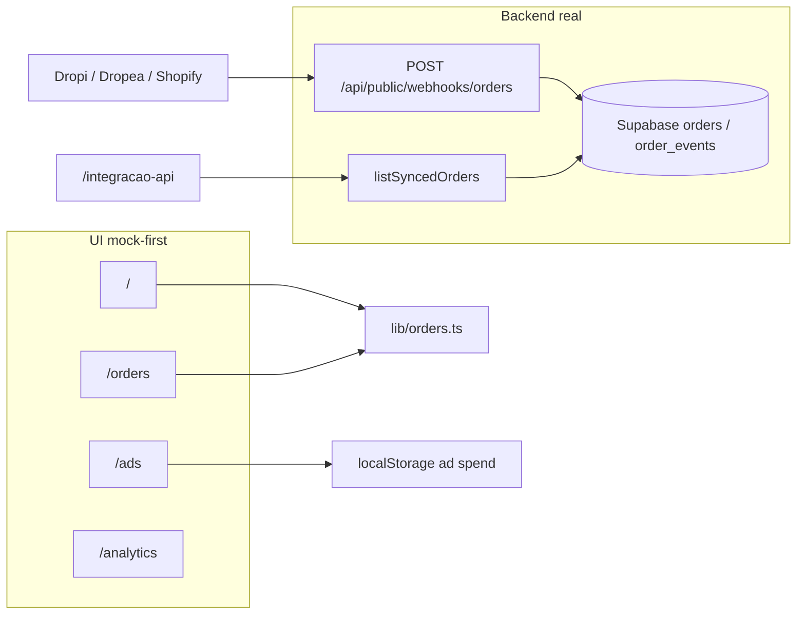

# ELEVATE Orders — Project Reader

Documento de leitura rápida do que já existe, o que está mockado e o que falta para produção.

**Stack:** TanStack Start + React 19 + TypeScript + Tailwind 4 + Supabase + shadcn/ui  
**Dev local:** `npm run dev` → [http://localhost:8080/](http://localhost:8080/)  
**Origem:** projeto Lovable (`AGENTS.md` — não reescrever histórico git publicado)

---

## Visão do produto

Dashboard para operações de dropshipping que:

1. Acompanha pedidos (confirmado / messaged / unanswered / incident)
2. Abre mensagens WhatsApp pré-preenchidas (e prevê automação via Business API)
3. Mostra lucro bruto/líquido e gasto de ads Meta
4. Recebe eventos de pedido por webhook (Dropi Pro / Dropea / Shopify)

---

## Rotas e funções da UI

| Rota | Página | O que faz hoje | Backend real? |
| --- | --- | --- | --- |
| `/` | Dashboard | Stats de status, ProfitPanel, MoneyPanel, plano Pro, OrdersBoard | Não (dados mock) |
| `/orders` | Orders | Board filtrável + cards + dialog WhatsApp | Não (mock `src/lib/orders.ts`) |
| `/analytics` | Analytics | KPIs + gráficos Recharts | Não (arrays hardcoded) |
| `/ads` | Integração Ads | Conta Meta, gasto, ROAS/CPA, campanhas | Parcial (`localStorage` gasto/conta; campanhas fake) |
| `/integracao-api` | Integração API | Docs do webhook + tabela de pedidos sync | Sim (`listSyncedOrders` + Supabase) |
| `/settings` | Settings | Form WA API + toggles Dropi/Dropea | Não (só `toast`) |
| `/pricing` | Pricing | Planos Free/Pro/Premium | Não (só `toast`) |
| `/help` | Help | FAQ + link WhatsApp suporte | Estático |
| `POST /api/public/webhooks/orders` | Webhook | Valida API key, upsert `order_events` + `orders` | Sim (precisa service role) |

---

## Domínio de pedidos (mock vs sync)

### Mock (UI principal)

Arquivo: `src/lib/orders.ts`

- 12 pedidos demo (ES, PT, LATAM, etc.)
- Status: `confirmed` \| `messaged` \| `unanswered` \| `incident`
- Helpers: `suggestedMessage`, `whatsappLink`, labels por motivo de incidência
- Usado por: Dashboard, Orders, MoneyPanel, ProfitPanel, MetaAdsPanel, OrderCard

### Sync (Supabase)

Migration: `supabase/migrations/20260810182503_*.sql`

- Tabelas: `orders`, `order_events` (RLS: SELECT para `authenticated`, ALL para `service_role`)
- Webhook grava eventos (dedupe por `order_id,event_date,status_id`) e atualiza snapshot em `orders`
- UI: só `/integracao-api` lista via server fn `listSyncedOrders`

**Gap crítico:** o board operacional ainda não consome a tabela `orders` do Supabase.

---

## Componentes de negócio

| Componente | Papel |
| --- | --- |
| `AppShell` | Header, nav, theme, busca global (não funcional), user fake “Rocío M.” |
| `OrdersBoard` | Tabs por status, busca ID/cliente/CEP; filtro de data **não aplica** |
| `OrderCard` | Preview mensagem + botão `wa.me` + Details |
| `OrderDetailDialog` | Edita mensagem, abre WhatsApp, “Queue send” (toast) |
| `ProfitPanel` | Lucro bruto/líquido; COGS 42%; ads de `localStorage` (`elevate-ad-spend`) |
| `MoneyPanel` | Retido em incidências vs recuperado; taxas Dropi/Dropea; EUR↔BRL |
| `MetaAdsPanel` | Toggle “Conectar Meta” (local), ID conta, gasto, ROAS/CPA, campanhas mock |
| `AnalyticsCharts` | Barras sent/replied + área tempo de resposta |

---

## Auth & Supabase

- Client browser: `VITE_SUPABASE_*` (chave publishable)
- Admin server: `SUPABASE_SERVICE_ROLE_KEY` (obrigatório para webhook e `listSyncedOrders`)
- Middleware: `attachSupabaseAuth` anexa Bearer em server fns; `requireSupabaseAuth` existe mas **não há tela de login**
- `.env` atual tem URL + publishable; **falta `SUPABASE_SERVICE_ROLE_KEY`**

---

## O que já está feito (checklist)

- [x] Shell visual ELEVATE (tema claro/escuro, sidebar, branding)
- [x] Fluxo UI completo de pedidos mock + WhatsApp one-click
- [x] Painéis financeiro / lucro / ads (cálculos client-side)
- [x] Página Analytics com charts
- [x] Settings / Pricing / Help (UI)
- [x] Webhook público tipado (Zod) + persistência Supabase
- [x] Página Integração API com feed dos pedidos sync
- [x] Tipos gerados Supabase + clients client/server
- [x] Error reporting Lovable / páginas 404 e erro

---

## O que está faltando (prioridade)

### P0 — bloquear “produto real”

1. **`SUPABASE_SERVICE_ROLE_KEY` no `.env`** — sem isso, webhook e lista sync quebram no server
2. **Unificar mock → Supabase** no OrdersBoard / Dashboard (mapear status_id/name → statuses da UI)
3. **Auth real** (login/signup) — RLS exige `authenticated` para ler orders no client
4. **Filtro de data** do OrdersBoard (state existe, não filtra)
5. **Persistência Settings** (credenciais WA, templates, toggles)

### P1 — automações prometidas na UI

6. Envio real WhatsApp Business API (hoje só `wa.me` / toast “test message”)
7. Sync real Dropi Pro / Dropea (hoje só webhook genérico + UI “Connected”)
8. OAuth / sync real Meta Ads (hoje toggle local + campanhas estáticas)
9. Billing / planos (Stripe ou similar)
10. Busca global + notificações no header

### P2 — qualidade

11. Testes automatizados (não há suite no repo)
12. Agente QA (criado: skill `elevate-web-qa`)
13. i18n consistente (UI mistura PT/EN)
14. `bun` no README vs `npm` local (bun não instalado neste ambiente)

---

## Mapa mental



---

## Como rodar

```sh
npm i
npm run dev
# http://localhost:8080/
```

Env necessário (mínimo):

- `VITE_SUPABASE_URL` / `SUPABASE_URL`
- `VITE_SUPABASE_PUBLISHABLE_KEY` / `SUPABASE_PUBLISHABLE_KEY`
- `SUPABASE_SERVICE_ROLE_KEY` ← **ainda não está no `.env` local**

---

*Gerado a partir da leitura do código-fonte do repositório Elevate_Orders.*
